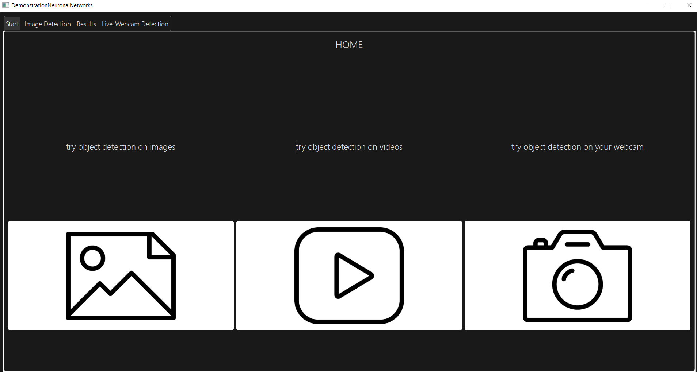
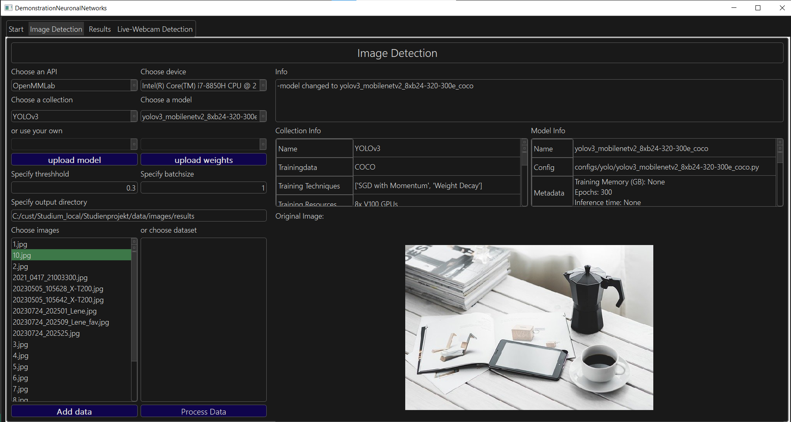

# PyQT Desktop-App for Object Detection using OpenMMLab

This Desktop-App can be used to test and evaluate different neuronal networks with the purpose for object detection on images and videos.
# Start Commands
Start App: 
`python .\app\app.py`

Start pyqt5 Designer:
`pyqt5-tools designer`

Convert newest Qt-Main-Window-File to python:
`pyuic5 -o main_window_ui.py .\Main_Window.ui`
  
Freeze anaconda environment:
  `conda env export --no-builds > ./setup/env_linux.yml`
# Some Examples






](documentation/output-01.png)

# Setting up
## 1. Install Miniconda3
#### On Linux: 
```
mkdir -p ~/miniconda3

wget https://repo.anaconda.com/miniconda/Miniconda3-latest-Linux-x86_64.sh -O ~/miniconda3/miniconda.sh

bash ~/miniconda3/miniconda.sh -b -u -p ~/miniconda3

rm -rf ~/miniconda3/miniconda.sh
````
init the command line
```
~/miniconda3/bin/conda init bash
~/miniconda3/bin/conda init zsh
```
#### On MacOS 
```
wget https://repo.anaconda.com/miniconda/Miniconda3-latest-MacOSX-x86_64.sh -O ~/miniconda.sh
bash ~/miniconda.sh -b -p $HOME/miniconda
```
#### On Windows

```bash
#download SetUP:
curl https://repo.anaconda.com/miniconda/Miniconda3-latest-Windows-x86_64.exe -o miniconda.exe

#Run Setup
start .\miniconda.exe

#delete setup again
del miniconda.exe

#ggf zur Path Variable hinzufügen:
"c:\tools\miniconda3"
"c:\tools\miniconda3\Scripts"

#initialize anaconda in Command Line
conda init
```
## 2. Setup Environment
```
conda env create -f ./setup/environment.yml --prefix ./env
conda activate ./env
```
### 3. Setup Packages
### On Linux: 
```
unzip -d ./app/packages/OpenMMLab ./setup/packages/mmdetection.zip
cd ./app/packages/OpenMMLab/mmdetection-main

unzip -d ./app/packages/ ./setup/packages/Hand_Gesture_Recognizer.zip
```
### On Windows: 
```
Expand-Archive ./setup/packages/mmdetection.zip -DestinationPath ./app/packages/OpenMMLab

#brauchts vermutlich nicht
pip install -U openmim
mim install mmengine
mim install "mmcv==2.0.0"
```
### Continue for all platforms: 
```bash

cd ./app/packages/OpenMMLab/mmdetection-main
pip install -v -e .

#Verify Installation of mmdetection
python demo/image_demo.py demo/demo.jpg rtmdet-ins-s --show --device cpu
```

If everything worked fine you can now go pack to your root-directory 
`cd ../../../..`
and start the app 
`python app/app.py`